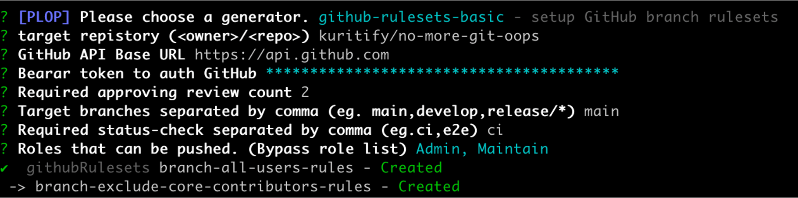
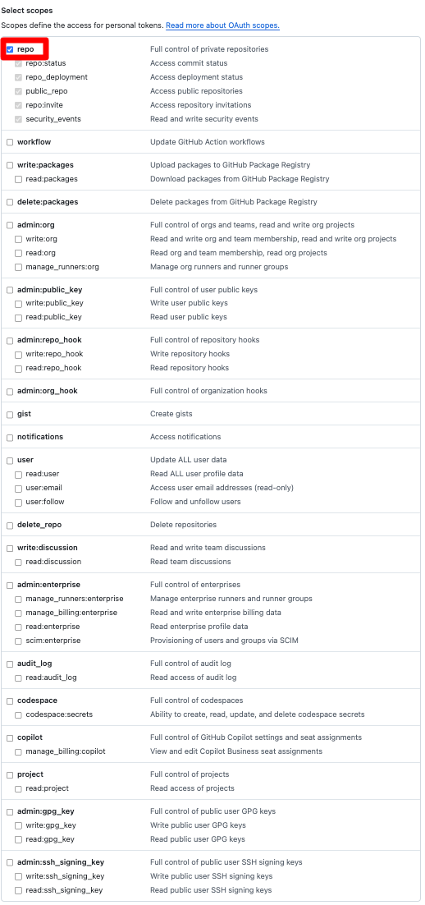

# no-more-git-oops

`no-more-git-oops` frees developers from human errors in Git operations by leveraging well-inspected [GitHub rulesets](https://docs.github.com/en/repositories/configuring-branches-and-merges-in-your-repository/managing-rulesets/about-rulesets).



`no-more-git-oops` is integrated with [PLOP](https://plopjs.com/), a "micro-generator framework," and provides three main functionalities:

* (out-of-the-box) Built-In PLOP to set up well-inspected GitHub rulesets
* Register a `no-more-git-oops` generator in your PLOP
* Customize GitHub rulesets and register them in your PLOP

## Installation
```bash
$ npm install -g no-more-git-oops
```

## Usage
If you are not familiar with PLOP, a quick read of the [overview](https://plopjs.com/documentation/#your-first-plopfile) and [custom action](https://plopjs.com/documentation/#setactiontype) sections will help you understand the rest of the story.

### Built-In PLOP
The Built-In PLOP sets up GitHub rulesets via interactive prompts.

```bash
$ nmgoops
? [PLOP] Please choose a generator. (Use arrow keys)
❯ github-rulesets-basic - set up GitHub branch rulesets
  github-rulesets-advanced - set up GitHub branch and tag rulesets

```

`no-more-gthub-rulesetes` provide two pattern of GitHub rulesests. These rulesets will are the following rules (**bold** indicates customizable options via interactive prompts):

Basic rulesets:
- Pushing to **the protected branches** require Pull Request (direct push are not allowed).
- The Pull Request must have **at least two review approvals** from someone other than the person who pushed the head branch.
- The approval must come from someone defined in CODEOWNERS.
- If the head branch is updated after approval, the previous approval will be reset (re-review is required).
- All discussions in the Pull Request must be resolved.
- The **required status checks** must pass.
- Only **allowed Organization Roles** can merge the Pull Request.
- Deleting or force-pushing to **the protected branches** is prohibited.
- Pull Request merges must enforce a linear history (Squash or Rebase).

Advanced rulesets:
- Same as the basic rules.
- CRUD operations on Git tags are only allowed via **GitHub Apps** (for integration with [release-please flow](https://github.com/googleapis/release-please)).

See [my blog post](https://zenn.dev/kuritify/articles/github-rulesets) for details. (Japanese only)

If you want a faster setup, consider [bypassing prompts](https://plopjs.com/documentation/#bypassing-prompts) in PLOP to provide answers directly.

```bash
$ nmgoops github-rulesets-basic -- \
  --repository <ower>/<repository> \
  --gitHubApiUrl "https://api.github.com" \
  --bearerToken <youru-token> \
  --requiredApprovingReviewCount 2 \
  --branchesCommaSeparated 'main,release/**' \
  --statusCheckCommaSeparated ci \
  --bypassRoles 0 --bypassRoles 1
```

### Register `no-more-git-oops` generator to your PLOP
You can register `no-more-git-oops` in your PLOP.

```javascript
// plopfile.mjs
import {setGitHubRulesetsGeneratorToPlop} from 'no-more-git-oops';

export default async function (plop) {
 // your generator
 plop.setGenerator('next-controller', {
   description: 'application controller logic',
   prompts: [{
       type: 'input',
       name: 'name',
       message: 'controller name please'
   }],
   actions: [{
       type: 'add',
       path: 'src/{{name}}.js',
       templateFile: 'plop-templates/controller.hbs'
   }]
  });

  // register no-more-git-oops generator
  await setGitHubRulesetsGeneratorToPlop(
    // generator name of basic rulesets
    "basic-github-rulesets",
    // generator name of advanced rulesets
    "advaced-github-rulesets",
    plop
  );
};
```

Then, execute your PLOP using the following command:

```bash
? [PLOP] Please choose a generator. (Use arrow keys)
❯ next-controller - application controller logic
  basic-github-rulesets - setup GitHub branch rulesets
  advaced-github-rulesets - setup GitHub branch and tag rulesets
```

### Customize GitHub rulesets and register them in your PLOP
`no-more-git-oops` also allows you to fully customize GitHub rulesets to meet your specific requirements using the [setActionType](https://plopjs.com/documentation/#setactiontype) API of PLOP.

```javascript
//  plopfile.json
mport {setGitHubRulesetActionToPlop} from 'no-more-git-oops';
import path from 'path';

export default  function (plop) {
  // set no-more-git-oops actions setActonType
  setGitHubRulesetActionToPlop('github-rulesets', plop);

  plop.setGenerator('my-github-rulesets', {
    prompts: [
      {
        type: 'input',
        name: 'repository',
      },
      {
        type: 'password',
        name: 'bararToken',
      }
    ],
    actions: [
      {
        type: 'github-rulesets',
        requestParamsTemleateDirs: [
          'github-rulesets-templates',
        ],
        bearerToken: '{{bearerToken}}',
        repository: '{{repository}}',
        targetBranches: ['main'],
      }
    ]
  });
};

```

The `github-rulesets-templates` folder will have the following structure:

```
./github-rulesets-templates/
├── all-users-rules.json.hbs
└── branch-exclude-core-contributors-rules.json.hbs
```

`no-more-git-oops` traverse json.hbs under specified template directories, then separately set rulesets one by one.

Please implement based on [well-inspected rulesets](https://github.com/kuritify/no-more-git-oops/tree/main/githb-rulesets-templates/basic) as a reference.

## Common Questions
### What should I use for the bearerToken to authenticate GitHub?

We recommend using classic personal access tokens (PAT) for their simplicity. The PAT requires the following permissions:


